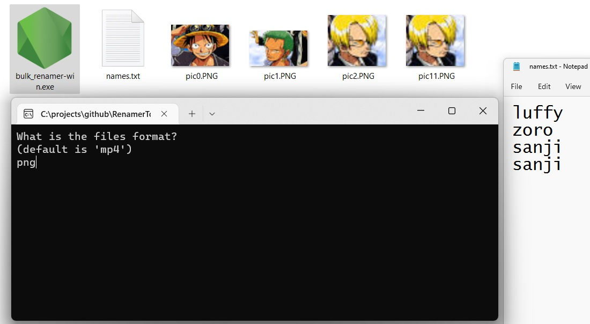

# Bulk Renamer

Rename files based on a list you provide, such as a list of videos you want to rename based on the table of contents. Here are some files which are ordered but do not have proper names:


They are listed in order in a text file named `names.txt`:

```
luffy
zoro
sanji
sanji
```

The tool will provide you with these episodic names:


## Warning

- You should test this app with some dummy files first, and then use it on your real files if it works
- Make sure you have a backup before you start the app
- This app renames the original files

## How to Use

- Make sure you have a 'names.txt' list with the same order as the files
- Download the latest version and place it beside your files.

**Please note**: names.txt must have new names that follow the naming order of the files in the directory.


